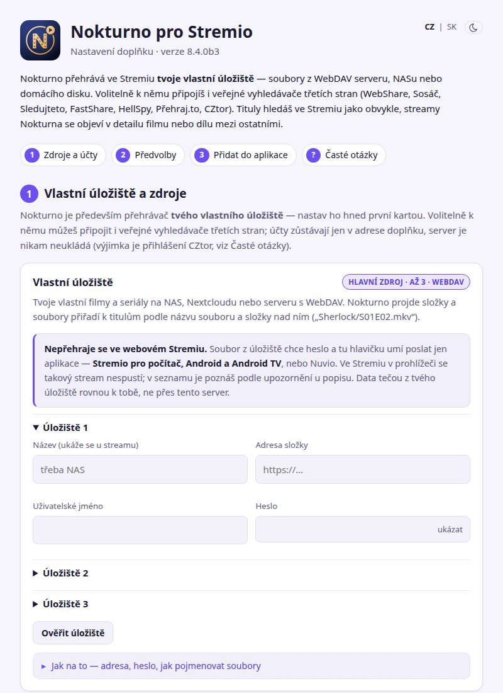

# Nokturno pro Stremio

[](https://ko-fi.com/matata86) [](https://paypal.me/matata86) [](#podpora)

Doplněk, který k filmům a seriálům ve Stremiu (i v Nuviu a dalších klientech
s doplňky Stremia) přehraje soubory z tvého **vlastního úložiště** (WebDAV).
Jako volitelnou doplňkovou službu si zapneš i vyhledávače třetích stran
**WebShare**, **Sosáč**, **HellSpy**, **Sledujteto**, **FastShare / Sdilej.cz**,
**Přehraj.to** a **CZtor**. Nokturno samo žádný obsah nehostuje ani nešíří. Podrobný návod je ve [wiki](https://github.com/matata86/nokturno-stremio/wiki).

## Jak přidat

1. Otevři **[nokturno.stream/configure](https://nokturno.stream/configure)**.
2. Vyplň účty ke zdrojům, které používáš (žádný není povinný) a klikni na **Přidat do Stremia** nebo **Přidat do Nuvia**.
3. Do Streamletu se adresa vkládá ručně (*Zkopírovat adresu*).



Nic se neinstaluje a nespouští – server běží u nás. Adresu, kterou formulář vydá, si uschovej:
je v ní tvoje nastavení a nikomu ji neposílej. Postup s obrázky je ve [wiki](https://github.com/matata86/nokturno-stremio/wiki/Instalace).

## Rodina Nokturno

Nokturno má tři klienty, všechny stojí na společném jádru [nokturno-core](https://github.com/matata86/nokturno-core):

| Klient | Co dělá | Navíc oproti Stremiu |
|---|---|---|
| [**Nokturno pro Kodi**](https://github.com/matata86/plugin.video.nokturno) | plnohodnotný doplněk s menu, výběrem streamu, stahováním, Hlídanými, SyncWatch, Traktem a TV programem | Luna, titulky z OpenSubtitles, synchronizace mezi zařízeními |
| [**Nokturno pro Home Assistant**](https://github.com/matata86/nokturno-ha) | HACS integrace, karta a služby; přehrává přes doplněk pro Kodi, hlídá nové díly sledovaných seriálů | Luna, torrenty (Prowlarr), stahování do HA |
| **Nokturno pro Stremio** (tento repozitář) | jen JSON pro Stremio, Nuvio a Streamlet, žádná instalace | – |

Stremio je záměrně nejjednodušší: nemá Lunu (ta má vlastní oficiální doplněk). CZtor (od 8.4.0)
se páruje PINem ve formuláři a server drží přihlášení zašifrované klíčem, který je jen v adrese doplňku.
Kdo chce víc – stahování, titulky z OpenSubtitles, Trakt, TV program – použije Kodi.

## Co umí

- **Streamy ke všemu s IMDb id.** Doplněk se chytá na všem, co má identifikátor IMDb (i `tmdb:` id od klientů), a k tomu přihodí své streamy. Detail titulu a díly seriálů dodá Stremio z Cinemety.
- **Vlastní úložiště** (od 3.1.0) – až tři WebDAV složky s vlastními soubory ve formuláři (s ověřením). Soubory jsou mezi streamy první.
- **Sedm volitelných vyhledávačů třetích stran** – WebShare, Sosáč, HellSpy, Sledujteto, FastShare / Sdilej.cz, Přehraj.to a CZtor; žádný není povinný. Přehraj.to (od 7.0.4) chce ve formuláři vlastní účet jako WebShare nebo Sledujteto: bez přihlášení API nevydá token a HTML z jedné serverové adresy dostane HTTP 429.
- **Volitelné katalogy** (od 5.1.0) – seznamy ze Sosáče a TMDB, žebříček „Nejsledovanější tento týden“, nové seriály s CZ/SK dabingem / titulky a **Koncerty** (od 8.1.0); každý se zapíná zvlášť ve formuláři. Sezónní katalogy (Vánoce, Film pro dnešní den) jsou v doplňku vždy, když platí.
- **Přímé přehrávání** (od 5.2.26) – vlastní úložiště a FastShare se přehrávají přímo ze zdroje (`behaviorHints.proxyHeaders` nese přihlášení), žádná proxy. Úložiště proto musí být dosažitelné ze serveru (hledání) i ze zařízení, kde se přehrává. ⚠️ Ve webovém přehrávači Stremia se tyto streamy nepřehrají, jen v aplikaci. Veřejná instance ignoruje úložiště s adresou na server samotný nebo link-local. Podrobně ve [wiki](https://github.com/matata86/nokturno-stremio/wiki/Zdroje-a-nastaveni#vlastní-úložiště).
- **Zprávy z dashboardu** – položka „📢 Nokturno" jako první stream; **jazyky** čeština, slovenština, angličtina i maďarština.

| | |
|---|---|
| Filmy | ano |
| Seriály | ano, včetně jednotlivých dílů |
| Titulky | ano, z WebShare a Sledujteto |
| Zvuk | jazyk, kanály a kodek – z hlavičky souboru, u Sledujteto přímo z API; u FastShare jen s neomezeným stahováním (na kredit by čtení hlaviček ubíralo kredit) |
| Katalogy | volitelně (od 5.1.0): Sosáč – nejpopulárnější filmy a seriály, nově přidané (i filmy s CZ/SK dabingem / titulky); nově přidané seriály s CZ/SK dabingem / titulky (jazyk ověřuje server podle streamů); TMDB – trendy, populární, nejlépe hodnocené (jen s klíčem instance `NOKTURNO_TMDB_KEY`); Koncerty – nově přidané a všechny. Jedna cache pro všechny, obnova po 6 h. Sezónní katalogy bez přepínače |
| Torrenty | ne – jen v integraci pro Home Assistant |
| Popisy titulů | ne – detail k položkám katalogů i k ostatním titulům dodává Cinemeta |

Streamy se řadí podle kvality a preferovaného jazyka, protože ve Stremiu je vidět
jen několik prvních řádků. Kvalitu, velikost, bitrate, jazyky zvuku i titulky
odhaduje jádro a co neví ze zdroje, přiznaně označí vlnkou (`~Full HD`).

## Anonymní statistiky

Doplněk posílá anonymní statistiky na stejný sběrný bod jako Nokturno pro Kodi
a Home Assistant: náhodný identifikátor nastavení, verzi, které zdroje jsou
zapnuté a u kterých titulů se otevřely streamy – nejvýš jednou za 6 hodin.
Jedna „instalace" je jedno nastavení doplňku (vlastní adresa), ne celý server.
Účty ani adresa doplňku se neposílají. Vypnutí: `NOKTURNO_STATS=0`. I po vypnutí se nejvýš jednou za 6 hodin pošle jen náhodný identifikátor a verze, aby bylo vidět, že nastavení žije – žádné tituly ani zdroje.

## Hlášení o pádech

Když při obsluze požadavku nastane neošetřená chyba v kódu (ne výpadek zdroje),
služba pošle na stejný server krátké hlášení: typ chyby, místo v kódu, verzi
a posledních pár řádků vlastního logu. Adresy, účty, IP a nastavení z adresy
doplňku se předem vymažou. Stejná chyba odejde nejvýš jednou za verzi. Id je
náhodné, jedno na server (`<data>/pady/id`). Vypnutí: `NOKTURNO_CRASH_REPORTS=0`.

## Veřejná instance

Veřejná instance běží na [nokturno.stream](https://nokturno.stream/). Nastavení s návody je na
`/configure`, včetně ověření účtů WebShare, Sledujteto, FastShare / Sdilej.cz a Přehraj.to,
párování CZtoru i ověření vlastních úložišť.

Instance je chráněná: ověřování účtů i streamy mají limity na uživatele, úložiště s adresou
na server samotný nebo link-local se ignoruje, `/play/` přijímá jen odkazy známých zdrojů,
stránky mají CSP hlavičky a účty se nezapisují do logu. Vlastní úložiště a FastShare netečou
přes server vůbec (viz Co umí výš). Server má poslouchat jen na `127.0.0.1` (`NOKTURNO_HOST`).

Aktuální verzi najdeš v [Releases](https://github.com/matata86/nokturno-stremio/releases).

## Vlastní instance (pro vývojáře a pokročilé)

**Běžný uživatel tuhle část nepotřebuje** – stačí [Jak přidat](#jak-přidat). Níže je návod
pro toho, kdo chce doplněk provozovat na vlastním serveru.

### Spuštění

```bash
cp .env.example .env      # vyplň účty
docker compose up -d
```

Pak otevřít `http://<adresa stroje>:7127/configure`, vyplnit účty a kliknout na
**Přidat do Stremia** nebo **Přidat do Nuvia**. Do Streamletu se adresa vkládá ručně
(*Zkopírovat adresu*). Na `/` je úvodní stránka s rozcestníkem všech repozitářů Nokturna.

Bez Dockeru to jde taky, závislosti žádné nejsou:

```bash
python3 -m nokturno.server --port 7127
```

### Účty jsou v adrese, ne na serveru

Stremio nemá soubor nastavení. Účty se nosí **zakódované v adrese doplňku**, takže
každý, kdo si ho přidá, má vlastní a hledá pod sebou. Server si z nastavení ukládá
jen zašifrované přihlášení k CZtoru; klíč k němu je v adrese.

```
http://<stroj>:7127/c/<nastavení>/manifest.json
```

Tu adresu vyrobí formulář na `/configure`. Uschovej si ji – bez ní se ke svému
nastavení nedostaneš a vyrobíš si prostě novou.

> Kódování **není šifra**. Kdo adresu má, stahuje z tvého WebShare. Nikomu ji
> neposílej.

Jde i nastavení z prostředí, pak má celá instance jednu konfiguraci a adresa je
bez prefixu. Takhle běžela verze 0.1.0 a funguje to dál.

Hodnoty jsou stejné jako v doplňku pro Kodi, takže se dají opsat z jeho
`settings.xml`.

| Proměnná | Co to je |
|---|---|
| `NOKTURNO_WS_USERNAME`, `NOKTURNO_WS_PASSWORD` | WebShare; místo hesla jde vložit i 40znakový salted hash |
| `NOKTURNO_STREAMUJ_USERNAME`, `NOKTURNO_STREAMUJ_PASSWORD` | Streamuj, kvůli Sosáči; místo hesla i hotový `md5(md5(heslo))` |
| ~~`NOKTURNO_LUNA_URL`, `NOKTURNO_LUNA_TOKEN`~~ | od 0.2.5 se nečtou – Luna má vlastní doplněk do Stremia |
| `NOKTURNO_ST_EMAIL`, `NOKTURNO_ST_PASSWORD` | Sledujteto – hledání chce účet, přehrávání Premium |
| `NOKTURNO_FS_USERNAME`, `NOKTURNO_FS_PASSWORD` | FastShare (od 5.1.0) – hledá se i bez účtu, přehrání jde z kreditu nebo neomezeného tarifu. Soubor si přehrávač stáhne přímo, cookie z přihlášení nese `behaviorHints.proxyHeaders` |
| `NOKTURNO_FS_PROVIDER` | `sdilej` = účet výš je ze Sdilej.cz (týž katalog, jiné účty); prázdné = FastShare |
| `NOKTURNO_PT_EMAIL`, `NOKTURNO_PT_PASSWORD` | Přehraj.to (od 7.0.4) – s Premium účtem přijde původní soubor, bez něj jen překódovaný. Na veřejné instanci se nenastavuje: účet je per-uživatel ve formuláři, jako u ostatních zdrojů |
| `NOKTURNO_TMDB_KEY` | klíč TMDB instance pro katalogy TMDB (od 5.1.0); bez něj se nabízejí jen katalogy Sosáče. Ve formuláři se nezadává |
| `NOKTURNO_HS_ENABLED` | HellSpy je veřejný, stačí přepínač; zapnutý ve výchozím stavu |
| `NOKTURNO_DAV1_URL` … `NOKTURNO_DAV3_NAME` | až tři vlastní úložiště (WebDAV): `_URL`, `_USERNAME`, `_PASSWORD`, `_NAME` |
| `NOKTURNO_PREF_LANG`, `NOKTURNO_PREF_SURROUND`, `NOKTURNO_SORT`, `NOKTURNO_HIDE_SD`, `NOKTURNO_MAX_BITRATE` | předvolby řazení a filtrování |
| `NOKTURNO_KATALOGY` | zapnuté katalogy, klíče oddělené čárkou (viz `nokturno/katalogy.py`) |
| `NOKTURNO_ID_SECRET` | tajemství pro podepsanou identitu v adrese (limity na uživatele); bez něj se identita nevydává |
| `NOKTURNO_STATS` | `0` vypne anonymní statistiky, viz níže |
| `NOKTURNO_CRASH_REPORTS` | `0` vypne hlášení o pádech služby, viz níže |
| `NOKTURNO_HOST`, `NOKTURNO_PORT`, `NOKTURNO_DATA` | na čem poslouchat (v Dockeru `0.0.0.0`, za reverzní proxy `127.0.0.1`), port a složka s cache |
| `NOKTURNO_CONFIGURE_PREFILL` | `1` předvyplní formulář účty z prostředí – jen na vlastní instanci, nikdy na veřejné |

Žádný zdroj není povinný. Bez nastavení běží doplněk jen s HellSpy.

### Jak to funguje

```
Stremio ──▶ /stream/movie/tt0133093.json ──▶ Engine.streams() ──▶ úložiště, WebShare, Sosáč, HellSpy,
                                                                     Sledujteto, FastShare, Přehraj.to, CZtor
                        ▼
            streamy s odkazem na /play/<payload>
                        ▼
Přehrávač ─▶ /play/<payload> ──▶ Engine.resolve() ──▶ 302 na soubor
```

**Proč to obchází přes `/play/`.** Odkazy WebShare, HellSpy, Sledujteto, Přehraj.to a CZtor nesou podpis a platí
jen chvíli. Kdyby se vydaly rovnou v odpovědi, do chvíle, než si uživatel stream
vybere, by vyhasly. Endpoint `/play/` proto soubor rozklíčuje až ve chvíli, kdy se
na něj přehrávač skutečně obrátí. Přijímá jen odkazy se známým schématem, jinak by
z něj šlo udělat otevřené přesměrování.

#### Proč bez závislostí

Jádro je čistý Python bez vazby na hostitele a jeho volání jsou blokující. HTTP
vrstva proto stojí na `http.server` ze standardní knihovny; `ThreadingHTTPServer`
obslouží každý požadavek ve vlákně, takže dlouhé hledání na WebShare nezablokuje
ostatní dotazy. Nasazení je tím jen zkopírování zdrojáků, bez `pip install`.

#### Jádro se needituje tady

`nokturno/core/` je **vysypaná kopie** z repa `nokturno-core`. Oprava udělaná tady
se při příštím rozeslání přepíše. Patří do jádra:

```bash
cd ../../nokturno-core
python3 tools/sync_core.py --check --diff stremio
python3 tools/sync_core.py stremio
```

### Testy

```bash
python3 -m unittest discover -s tests -v
```

Nesahají na síť a nepotřebují účty. Jádro má vlastní testy ve svém repu.

## Pomoc

- **Dotazy, rady a novinky:** [facebooková skupina Nokturno](https://www.facebook.com/groups/nokturno). Odpovídáme tam my i ostatní uživatelé.
- **Řešení častých potíží:** [nápověda Nokturna](https://matata86.github.io/nokturno-napoveda/). Podrobné návody k nastavení jsou ve [wiki](https://github.com/matata86/nokturno-stremio/wiki).
- **Chyba v kódu** (pád nebo chování, které jde zopakovat): [GitHub Issues](https://github.com/matata86/nokturno-stremio/issues). Napiš, ve kterém klientovi (Stremio, Nuvio, Streamlet) a u kterého titulu to nastalo. Adresu doplňku neposílej, jsou v ní tvoje účty.

## Právní upozornění

Nokturno je především přehrávač a správce tvého vlastního úložiště – obsah, který
si nahraješ a zpřístupníš (např. přes WebDAV), přehrává napřímo. Jako doplňkovou
službu si můžeš volitelně napojit i některé veřejně dostupné vyhledávače třetích
stran (WebShare, Sosáč, HellSpy, Sledujteto, FastShare, Přehraj.to, CZtor, Luna,
OpenSubtitles) – v tom případě je Nokturno jen technické rozhraní, samo žádný
obsah nehostuje, neukládá ani neposkytuje.

Nokturno smíš používat jen k obsahu, ke kterému máš zákonné oprávnění, licenci
nebo jiný právní titul. Vyhledávání, zpřístupňování nebo přehrávání autorsky
chráněného obsahu bez souhlasu nositelů práv je zakázáno.

Nokturno je poskytováno „tak, jak je“, bez záruky funkčnosti, dostupnosti ani
legálnosti zdrojů třetích stran. Za způsob použití odpovídáš výhradně ty.
Provozovatel si vyhrazuje právo kdykoli omezit nebo ukončit přístup.

Plný text a kontakty pro nahlášení nelegálního obsahu u jednotlivých zdrojů:
[nokturno.stream/terms](https://nokturno.stream/terms).

## Licence

Zdrojový kód je veřejně čitelný pro transparentnost a instalaci přes oficiální
kanály (GitHub Releases, repozitář zipů). Kopírování, úpravy a šíření bez
svolení autora nejsou dovolené – viz [LICENSE](LICENSE).

---

## Podpora

[](https://ko-fi.com/matata86)

- **Ko-fi:** https://ko-fi.com/matata86
- **PayPal:** https://paypal.me/matata86
- **Bitcoin:** `bc1qhjwt8xxmuym0xsd50yfpvjph00386uz73gqwlc`
